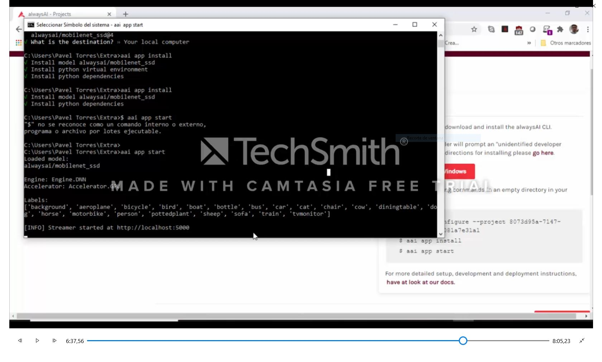
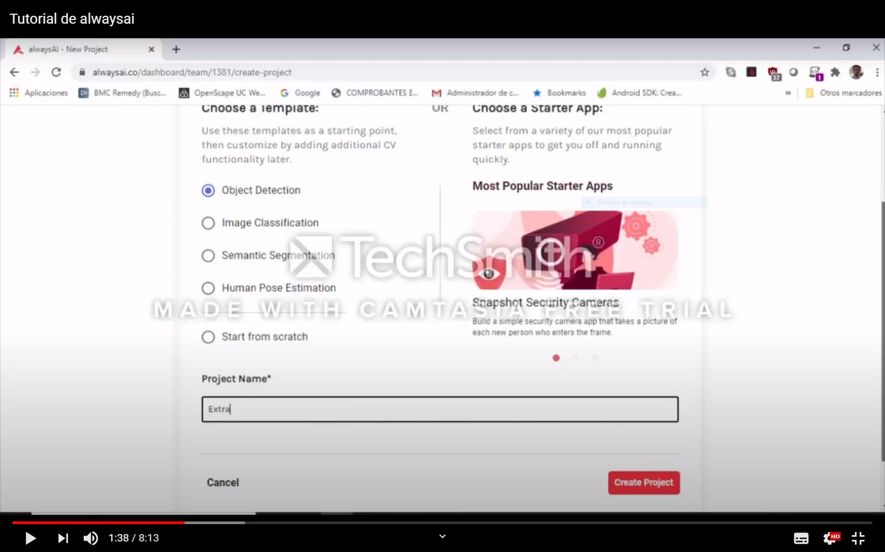

# Trabajo Extra
# Informe 
##  Estudio de la plataforma AlwaysAI y sus principales características

## 1.PLANTEAMIENTO DEL PROBLEMA

Para el manejo de Inteligencia Artificial se han desarrollado innumerables herramientas de software, algunas de propósito general y al mismo tiempo herramientas de propósito específico  orientadas a resolver problemas como es el reconocimiento de imágenes mediante el aprendizaje de su comportamiento. En este sentido nos hemos planteado realizar un estudio básico de la plataforma AlwaysAI. 

## 2.OBJETIVOS

### General:

Construir una guía básica para el manejo de la Plataforma AlwaysAI, utilizando elementos de aprendizaje rápido como son imágenes, video, conceptos y ejemplos prácticos.

### Específicos:

> Estudio de las herramientas y ambiente de desarrollo de AlwaysAI.
 
> Diseño y desarrollo de un ejemplo práctico utilizando la plataforma AlwaysAI.

> Estructurar la información obtenida como insumo para realizar un video Tutorial.

## 3.ESTADO DEL ARTE

### Tema: TÉCNICAS DE INTELIGENCIA ARTIFICIAL UTILIZADAS EN EL PROCESAMIENTO DE IMÁGENES Y SU APLICACIÓN EN EL ANÁLISIS DE PAVIMENTOS

Revista EIA, vol. 16, núm. 31, 2019

Escuela de Ingeniería de Antioquia

Debido al incremento en los costos de mantenimiento, rehabilitación y construcción de vías, estudiar las estructuras de pavimento para determinar su comportamiento y sus características mecánicas propias analizando la distribución y posición de sus partículas, se ha vuelto un campo de gran importancia en la ingeniería. Las nuevas herramientas de análisis buscan hacer este estudio más eficiente reduciendo su costo y tiempo de ejecución mediante el procesamiento digital de imágenes. El procesamiento digital tradicional está limitado en su sensibilidad ante perturbaciones externas que puedan modificar la imagen, por eso se han implementado diferentes técnicas de inteligencia artificial (IA) para optimizar los algoritmos. Este trabajo presenta una revisión de las diferentes aplicaciones de técnicas de IA recientes en el procesamiento de imágenes. Después se revisan los trabajos realizados específicamente con imágenes de pavimentos y se presentan posibles implementaciones futuras en este campo utilizando inteligencia artificial.

### The New Artificial Intelligence Market

by Aman Naimat
Released August 2016
Publisher(s): O'Reilly Media, Inc.
ISBN: 9781491962329

Como ocurre con otras tecnologías introducidas en la última década, la inteligencia artificial es objeto de muchas predicciones del mercado. Pero, ¿qué es exactamente la adopción comercial actual de la IA más allá de los laboratorios académicos? En este informe de diez páginas, el cofundador de Spiderbook, Aman Naimat, proporciona los resultados de un análisis basado en datos sobre las industrias y empresas estadounidenses que utilizan o crean productos de IA en este momento.

Aunque algunas de las llamadas aplicaciones de IA no son en realidad cognitivas, existen tecnologías capaces de lograr inteligencia a nivel humano o sobrehumano en determinadas tareas. Naimat y su equipo examinaron cerca de 500.000 empresas y utilizaron el modelo de aprendizaje automático basado en gráficos de Spiderbook para leer la Internet empresarial y clasificar las empresas en diferentes niveles de madurez de IA.
Con un gráficos y visualizaciones llamativos, este informe presenta hallazgos que incluyen:

 
## 4.MARCO TEÓRICO
 
### Plataforma AlwaysAI
 
La plataforma AlwaysAI permite construir aplicaiones basado en modelos que aplican Inteligencia Artificial. Se basa en la observación mediante una cámara de video conectada a un computador el cual procesa el video capturado mediante modelos de AI.

La plataforma alwaysAI sirve para desarrollar una aplicación de visión por computadora en su computadora local y luego instalar la aplicación localmente o en un dispositivo periférico con la CLI alwaysAI.

Para los dispositivos periféricos, la CLI instala los archivos de su aplicación en el dispositivo periférico mediante SSH.
Las aplicaciones desarrolladas con AlwaysAI son compatibles con las siguientes plataformas de hardware:

 

### Componentes de la Plataforma AlwaysAI
 
-	Desarrollo de aplicaciones, está compuesto por un conjunto de llamadas a librerías desarrolladas en Phyton las cuales realizan todo el procesamiento de Inteligencia Artificial. Los elemento que se deben estructurar en una aplicación en la plataforma AlwaysAI son los siguientes

>Inicialización: En esta etapa, configuraremos todos los objetos necesarios que se utilizarán en las secciones posteriores. Primero, cree una instancia del objeto de detección de objetos. Luego, cargue el detector en el motor DNN, que por defecto es el acelerador de GPU. A continuación, configure la transmisión de video de la cámara web y depure el transmisor como administradores de contexto:
 
>Bucle de procesamiento de fotogramas: Ciclo de procesamiento de la trama principal.

>Realizar inferencia: Tome un fotograma de la cámara web y realice una inferencia de detección de objetos en el fotograma

>Post – procesamiento:  Con la información previamente procesada presentamos un conjunto de valores tipo stream en el sitio web generado (pe. Porcentaje de similitud)

>Análisis final y limpieza: Una vez que salga del ciclo de procesamiento de fotogramas, puede finalizar el contador de FPS e imprimir las estadísticas recopiladas.

-	AlwaysAI CLI, despliega la aplicación desarrollada en el computador loca o en la plataforma remota.

-	Modelos, el catálogo de modelos alwaysAI proporciona un conjunto de modelos de aprendizaje automático previamente entrenados que cuando se combinan con las API de alwaysAI edgeIQ, permiten a los desarrolladores crear rápidamente un prototipo de una aplicación de visión por computadora sin la necesidad de crear y entrenar primero un modelo personalizado. Estos modelos previamente entrenados cubren la clasificación de imágenes y la detección de objetos. 

- EdgeIQ Phyton API: Conjunto de librerías desarrolladas en Phyton para la construcción rápida de aplicaciones en la plataforma AlwaysAI.

Aplicación en el ámbito deportivo para mejorar las técnicas para ejecutar una actividad de la manera más eficiente (Posición del cuerpo humano). 

*Aplicación en el área de marketing para identificar la satisfacción al cliente en función de los rasgos que presenta la cara de los clientes después de ser atendidos (Clasificación por Características). 

*Aplicación en el manejo de inventarios dentro de una bodega o línea de producción  para clasificación (Detección de Objetos)

*Aplicación en el ámbito vehicular identificando el incumplimiento de las reglas de transito que están pintadas en las vías públicas  (Segmentación Semántica).

## 5. DESARROLLO DE UN EJEMPLO PRACTICO

Para la creación de una aplicación debemos seguir los siguientes pasos:

  1.	Creamos un usuario en el sitio Web de AlwaysAI: https://alwaysai.co/
  
  2.	Confirmamos el usuario creado en la cuenta de correo registrada.
  
  3.	Iniciamos sesión en el sitio https://alwaysai.co/
  
  4.	Nos ubicamos en la pantalla Dashboard
  
  5.	Presionamos el botón  +New Project
  
  
  
  6.	Seleccionamos el tipo de proyecto utilizando una PLANTILLA
  
  
  
  7.	Ingresamos el nombre del Proyecto y Creamos el proyecto
  
  
  
  8.	Descargamos e instalamos el CLI para Windows
  
  
  
  9.	Ejecutamos los comandos que nos guía en el Dashboard en la línea de comandos de Windows:

        *Creamos un directorio de trabajo: mkdir detección
        *Ingresamos al directorio creado: cd detección
        *Ejecutamos: aai app configure --project 904d8682-eb5b-4fc7-a57a-1d0fbbfc370e
        *aai app install
        *aai app start
        
  10.	Desde el navegador de internet de la maquina ingresamos a http://localhost:5000
  
  11.	Utilizamos la aplicación.

## 6. LISTA DE COMPONENTES 

#### Diseño y desarrollo de un ejemplo práctico utilizando la plataforma AlwaysAI

- Sitio https://alwaysai.co/
- Pantalla Dashboard
- Computador
- Internet
- Navegador
- Linea de comandos(cmd)
 
## 7. APORTACIONES

#### Diseño y desarrollo de un ejemplo práctico utilizando la plataforma AlwaysAI publicado en la nube

Publicar el sitio web hacia el Internet para vigilancia y control  de la funcionalidad del sistema identificando objetos que se presentan frente a la cámara local donde se ejecuta la aplicación.

#### Implementación de una interfaz HMI en NODE-RED

## 8. CONCLUSIONES

La plataforma AlwaysIA utiliza básicamente la computación basada en la visión de imagenes y video y su principal elemento de hardware es la cámara de video acoplada al computador.

Utiliza los Models como patrones de comportamiento de las imágenes y las clasifica en Detección de Objetos, Clasificación por características, Posición del cuerpo humano y Segmentación Semántica.

La aplicación práctica del uso  plataforma AlwaysAI sería por ejemplo: 

*Aplicación en el ámbito deportivo para mejorar las técnicas para ejecutar una actividad de la manera más eficiente (Posición del cuerpo humano). 

*Aplicación en el área de marketing para identificar la satisfacción al cliente en función de los rasgos que presenta la cara de los clientes después de ser atendidos (Clasificación por Características). 

*Aplicación en el manejo de inventarios dentro de una bodega o línea de producción  para clasificación (Detección de Objetos)

*Aplicación en el ámbito vehicular identificando el incumplimiento de las reglas de transito que están pintadas en las vías públicas  (Segmentación Semántica).

 
## 9.RECOMENDACIONES

El uso de software desarrollado en la plataforma AlwaysAI deberá utilizarse para reemplazar las actividades realizadas por humanos en tareas visuales que se vean comprometidas por el incremento de volumen de objetos que deben ser observados y que superan las capacidades del ojo humano, así como la capacidad de identificar las características y comportamiento.
 
El perfeccionamiento deportivo es un área que debería utilizar software de estas características. El uso de la técnica y tecnología permite la producción e identificación de deportistas de élite.
 
 ## 10.BIBLIOGRAFÍA:

Aman Naimat. (2016). The New Artificial Intelligence Market [Book]. https://www.oreilly.com/library/view/the-new-artificial/9781492048978/

Introduction — alwaysAI SDK documentation. (2020). https://alwaysai.co/docs/getting_started/introduction.html

Oscar Javier Reyes-Ortiz, M. M. J. S. U.-C. (2018). Fuzzy job-shop scheduling problems: A review. Information Sciences, 278, 380–407. https://doi.org/10.1016/j.ins.2014.03.060
 
 
## 11. ANEXOS

 
